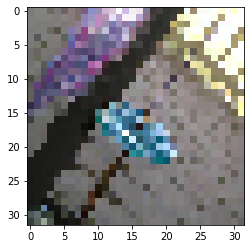

# noise2noise
> EE-559 project 1, 2


You can access the documentation [here](https://thurgarion2.github.io/noise2noise/) !!!

## Set up the environnement

To set up your environement, you need :
- install [nbdev](https://nbdev.fast.ai/tutorial.html) and standard other libraries such as torch, jupyter ..
- clone the repo
- download the [dataset](https://drive.google.com/drive/u/2/folders/1CYsJ5gJkZWZAXJ1oQgUpGX7q5PxYEuNs) (you need to be connect to epfl account) and put it in `/dataset` folder.
- run this notebook to be sure that all works

## Run this to check that all is fine

```
noisy_imgs_1 , noisy_imgs_2 = load_images()
show_img(to_float_image(noisy_imgs_1[0]))
```





## Create a module

Nbdev is helpfull for 2 things. First, it fix some problems with the integration of notebook with github. Second, it allow to export notebooks as modules and generate documentation automatically.

To export a notebook as a module, you should add `# default_exp module_name` at the top (ex: #default_exp helpers) and add `#export` in cell you want to exports (you can read 00_helpers to have an exmaple). You can also add `#hide` in cell that you don't want to be displayed in the documentation.

## Push code to github

Before pushing code, you should run :
- nbdev_build_lib 
- nbdev_build_docs
- nbdev_test_nbs
- git add -A; git commit -m'???'; git push

in that order

if pull and have conflicts run :
- nbdev_fix_merge (you still have to resolve conflicts, but you can do it in notebooks)

**do not hesitate to ask questions**
